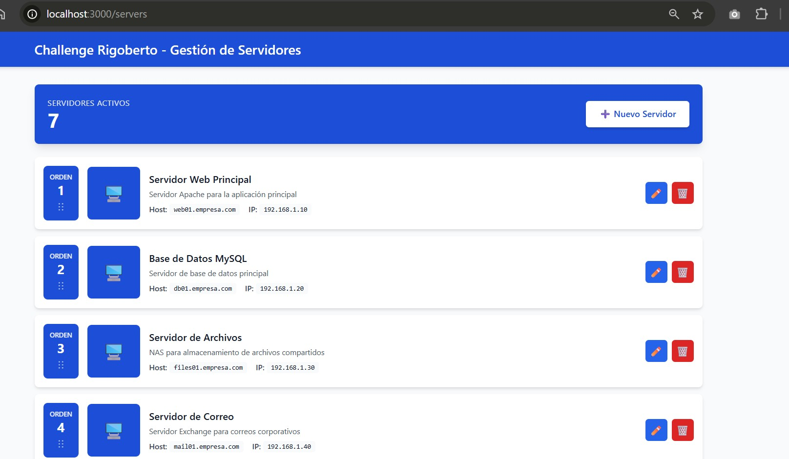
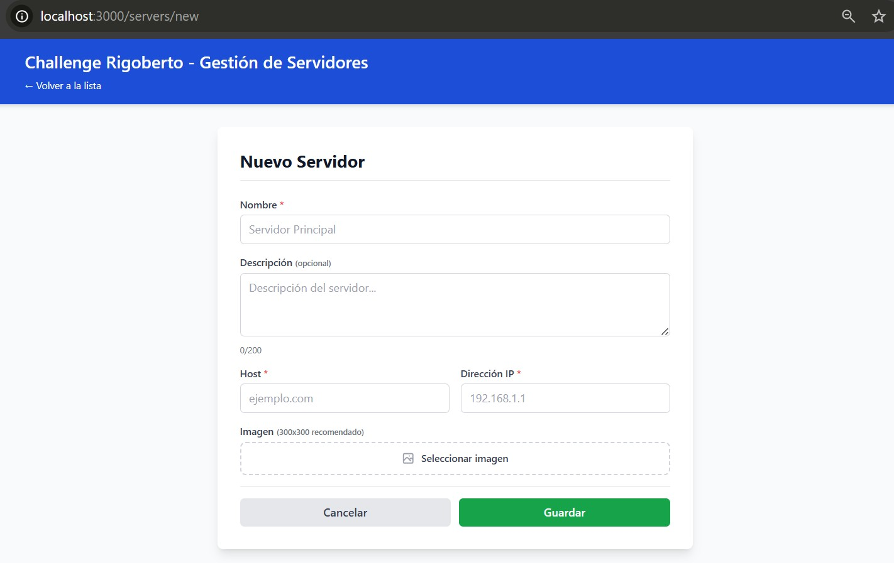

# Cómo Levantar el Proyecto

Guía simple para instalar y ejecutar el proyecto en tu computadora.

---

## Requisitos

1. **Git**
2. **Docker Desktop**

---

## Instalación

### 1. Descarga el proyecto

```bash
git clone https://github.com/rigobertomeneses/matrice.git
cd matrice
```

### 2. Abre Docker Desktop y levanta el proyecto
```bash
docker-compose up -d
```

### 3. Configura el backend

Ejecuta estos comandos uno por uno:

```bash
docker exec servers_backend composer install
docker exec servers_backend php artisan key:generate
docker exec servers_backend php artisan migrate
docker exec servers_backend php artisan db:seed
docker exec servers_backend php artisan storage:link
docker restart servers_backend
```

### 4. Configura el frontend

```bash
docker exec servers_frontend npm install
```

## 5. Verifica que funciona

Abre tu navegador:

- **Frontend**: http://localhost:3000
- **Backend**: http://localhost:8000/api/servers


## Info sobre tests unitarios

```bash
# Backend
docker exec servers_backend php artisan test

# Frontend
docker exec servers_frontend npm test -- --run
```

---

## Capturas de Pantalla

### Listado de Servidores


### Nuevo Servidor

